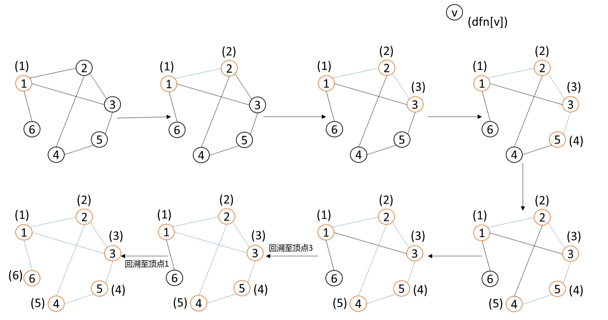
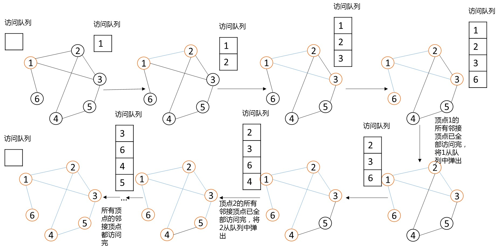

# 第二章 搜索问题
搜索在图论中有着广泛的应用。许多图的问题需要遍历整个图，才能获得最优解。  
深度优先搜索和广度优先搜索是图论中最常用的两种搜索技巧。
## 深度优先搜索(Depth-First-Search)

深度优先搜索，简称为"dfs",所遵循的搜索策略是尽可能“深”地搜索。它的基本思想是：为了求得问题的解，先选择某一种可能情况向前（子结点）探索，在探索过程中，一旦发现原来的选择不符合要求，就回溯至父亲结点重新选择另一结点，继续向前探索，如此反复进行，直至求得最优解。深度优先搜索的实现方式可以采用递归或者栈来实现。

对图`G`进行深度优先搜索，会产生一个深度优先搜索树，在搜索时对顶点加上搜索的时间戳，这个搜索树会显现一些良好的性质,我们用dfn数组记录深度优先访问的某顶点的时间,visit数组记录某顶点是否已经被访问过。

1. 从图`G`某一顶点v开始深度优先搜索过程:标记`v`已经被访问过,深度优先搜索`u`的邻接顶点`u`；
2. 然后递归地进行这一过程，直到此刻访问的顶点`v`没有邻接顶点或者它的邻接顶点已经全被标记过时，进行回溯。

代码

	dfs(int v){
		visit[v] = true;
		dfn[v] = time++;
		for(int i = head[v];i != -1;i = edge[i].pre){//依次访问顶点v的邻接顶点
	        int u = edge[i].cur;
	        if(visit[u] == fasle){
	        	printf("%d ",u);
	        	dfs(u);
	        }
	    }
	    return;
	}

  
图2.1 深搜图

  
图2.2 深搜树

深搜，某种意义上，可以称之为一种枚举，在不剪枝的情况下，会尽可能的搜索所有可能状态，直到找到解为止，时间复杂度通常呈几何速度增长。当深搜应用于图的遍历时，若图采用邻接表的储存形式，它的时间复杂度将是`O(|E|)`。

#### 剪枝

深搜在求解图的连通性等问题上有着广泛的应用，我们将在下一章进行详细介绍。
## 广度优先搜索（Breadth-First-Search）

广度优先搜索，简称“bfs”，顾名思义，尽可能广地进行搜索。

  
图2.3 广搜图